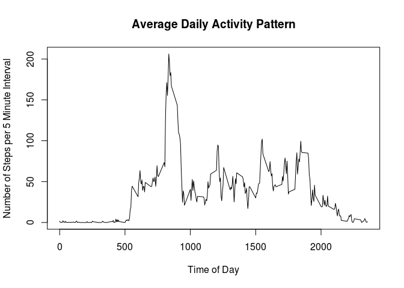
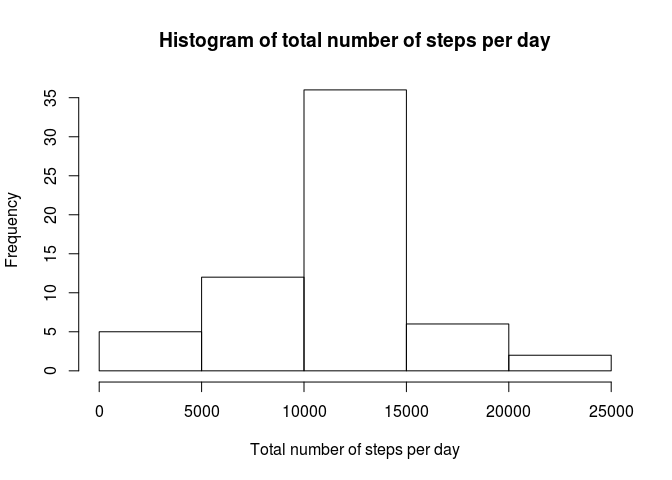
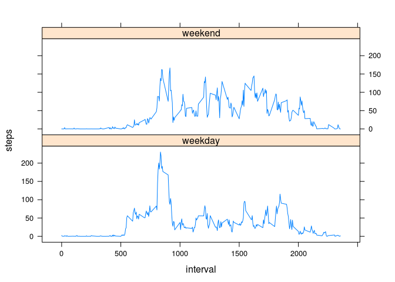

# Reproducible Research: Peer Assessment 1


## Loading and preprocessing the data

The source data file `activity.zip` is extracted and the contained file `activity.csv` is read into a data frame `activity` which will be used throughout the remainder of the exercise. After the data frame has been populated the extracted csv file can be removed again.


```r
unzip("activity.zip")
activity <- read.csv("activity.csv")
rm <- file.remove("activity.csv")
str(activity)
```

```
## 'data.frame':	17568 obs. of  3 variables:
##  $ steps   : int  NA NA NA NA NA NA NA NA NA NA ...
##  $ date    : Factor w/ 61 levels "2012-10-01","2012-10-02",..: 1 1 1 1 1 1 1 1 1 1 ...
##  $ interval: int  0 5 10 15 20 25 30 35 40 45 ...
```

## What is mean total number of steps taken per day?


```r
steps.by.day <- aggregate(steps ~ date, data = activity, sum)
hist(steps.by.day$steps, xlab = "Total number of steps per day", 
     main = paste("Histogram of total number of steps per day"))
```

 

The histogram shows that the mean total number of steps per day must be in the range of 10,000 to 15,000.

The exact mean and median values of the total number of steps per day are similar but not equal:

```r
mean(steps.by.day$steps)
```

```
## [1] 10766.19
```

```r
median(steps.by.day$steps)
```

```
## [1] 10765
```

## What is the average daily activity pattern?

The first step to answer this question is to group the data by the five minute intervals
and compute the mean for each group:

```r
steps.by.interval <- aggregate(steps ~ interval, data = activity, mean)
```

For a visual inspection, the following code plots a time series graph on the average daily 
activity pattern.

```r
plot(steps.by.interval, type="l",
     xlab="Time of Day",ylab="Number of Steps per 5 Minute Interval",
     main="Average Daily Activity Pattern")
```

 

One can clearly identify several spikes throughout the day and very few activity during evening and night hours. The maximum spike takes place before 9 a.m. and has an average value of more than 200 steps in five minutes. 

The exact time period can be selected with the help of the `which.max()` fuction:

```r
steps.by.interval[which.max(steps.by.interval$steps), 1]
```

```
## [1] 835
```

The exact number of steps for this time interval:

```r
max(steps.by.interval$steps)
```

```
## [1] 206.1698
```

Between 8:35 and 8:40 the average number of steps reaches its maximum value.

## Imputing missing values

For a substantial amount of five minute intervals there is no measurement for the number of steps available:

```r
sum(is.na(activity$steps))
```

```
## [1] 2304
```

```r
sum(is.na(activity$steps)) / nrow(activity)
```

```
## [1] 0.1311475
```

The strategy to cope with these missings is to fill in the mean value for the respective time interval. 

For this purpose the `mutate()` function from the `dplyr` package provides a very concise syntax. The imputed data is stored in a new data frame `imputed`.

```r
library(dplyr, warn.conflicts=FALSE)
imputed <- activity %>%
      mutate(steps = ifelse(is.na(steps),steps.by.interval$steps,steps))
```

A histogram plotted from the imputed data looks very similar to the previous histogram with 
the exception that the number of days on the Y axis has increased from about 27 to about 35.
This increment corresponds roughly to the number of imputed five minute intervals.


```r
steps.by.day <- aggregate(steps ~ date, data = imputed, sum)
hist(steps.by.day$steps, xlab = "Total number of steps per day", 
     main = paste("Histogram of total number of steps per day"))
```

 

Mean and median value are now equal and have the same value as the mean value without imputation of missing data.

```r
mean(steps.by.day$steps)
```

```
## [1] 10766.19
```

```r
median(steps.by.day$steps)
```

```
## [1] 10766.19
```


## Are there differences in activity patterns between weekdays and weekends?


```r
# Note: week day selection is locale dependent, 
#   e.g., in a German locale the weekend relates to `wd` 0 and 6
daytype = factor(ifelse(as.POSIXlt(imputed$date)$wd %in% 1:5, "weekday", "weekend"))
imputed$daytype <- daytype
```


```r
steps.by.interval <- aggregate(steps ~ interval + daytype, data = imputed, mean)

library(lattice)
xyplot(steps ~  interval | daytype, data = steps.by.interval, layout = c(1, 2), type="l")
```

 

The activity pattern shows differences between weekdays and weekends. Weekends show more spikes in the area of 150 average steps per five minute interval stretched over the day. Furthermore, activity on weekends starts slower/ later compared to weekdays. 
